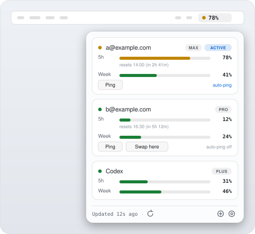

<div align="center">

# QuotaBar

**A native macOS menu bar app that tracks AI usage limits across multiple accounts,
for people who hold more than one paid AI subscription and switch between them.**

<picture>
  <source media="(prefers-color-scheme: dark)" srcset="assets/popover-dark.svg">
  
</picture>

<sub>*Illustration, not a screenshot — the accounts and percentages shown are made up.*</sub>

[](LICENSE)
[](#requirements)
[](#requirements)
[](#first-launch-gatekeeper)

[What it does](#what-it-does) · [How it works](#how-it-works) · [Install](#install) ·
[Security](#security-and-privacy) · [Configuration](#configuration) · [Uninstall](#uninstall)

</div>

QuotaBar shows the current 5-hour and weekly usage for each of your Claude Code
accounts and your ChatGPT/Codex account, side by side, in the menu bar. It can
also switch which Claude account Claude Code is logged into, so you can move work
onto a different account's rate limit without logging out and back in by hand.

It has two parts:

- **`app/`** — the SwiftUI menu bar app (the UI). Every usage number it shows comes
  from the scripts; its only network call of its own is a once-a-day, anonymous check
  for a newer release, which you can turn off (see [Security](#security-and-privacy)).
- **`scripts/`** — a set of bash + Python scripts (the "account bank") that read
  usage from the providers, store per-account credentials locally, and perform the
  account switches. These also work on their own from the command line, or as a
  SwiftBar plugin.

> **Status:** personal tool, released as-is. Both usage endpoints it reads are
> **undocumented** (see [Security](#security-and-privacy)) and may change or break
> at any time. macOS 14+, Apple Silicon.

## What it does

- **Per-account usage at a glance.** The menu bar icon is tinted by the active
  account's worst current limit (green / amber / red), with a dropdown showing each
  account's 5-hour and weekly windows, reset times, and plan tier.
- **Switch accounts ("swap").** One click writes a banked account's credentials
  into Claude Code's login and updates its identity file, so your running Claude
  Code sessions bill that account from their next request. No browser re-login.
- **Auto-pick (opt-in).** At the start of a new Claude Code session, a hook can
  automatically select the healthiest account by plan tier and remaining quota,
  rather than you choosing manually.
- **Ping / auto-ping (opt-in).** A "ping" runs one minimal turn on an account to
  start its idle 5-hour window early, so the clock is already running before a work
  block. Auto-ping keeps a window running for opted-in accounts. Both are rate-
  limited (30-minute cooldown) and cost a few small turns per day at most.
- **Codex / ChatGPT usage (read-only).** Your Codex usage is displayed alongside
  Claude. QuotaBar never modifies or refreshes the Codex token — the Codex CLI owns
  it.

These features exist to make owning several subscriptions less tedious to manage.
QuotaBar does not create accounts, generate credentials, or circumvent any
provider's controls — it reads the same usage the provider shows you and switches
between logins you already own.

## How it works

Claude Code reads its login from one keychain slot on **every request**, not once at
launch. QuotaBar is built on that fact.

**The shared rail.** Your terminal sessions all read the default keychain slot — the
"rail". Clicking **Swap here** on an account runs `swap-account.sh`, which writes that
account's banked credentials into the default slot under a lock. Every running session
that isn't pinned picks the new account up on its next request: no logout, no restart,
no interruption mid-conversation. This is the normal way to use QuotaBar, and the only
mode most people need.

**Pinned sessions (opt-in).** Sometimes you want a session to *stay* on one account —
an overnight agent run that must not follow a swap, or work you want billed to a
specific plan. Launch it with:

```sh
~/.local/share/quotabar/account-bank/claude-acct you@example.com
```

That session gets its own config home and reads *that* home's credential slot, so rail
swaps never move it. Pinned sessions are per-session and explicit; nothing is pinned
unless you ask for it. Pinning needs `./install.sh --with-pinning`, which records where
your real `claude` binary lives so the launcher can find it.

**One swap at a time.** A swap is guarded by `--expect-active`: if the active account
changed between the moment the card was drawn and the moment the script runs, the swap
aborts rather than clobbering a newer one, and the card says "Active account changed —
try again". The app disables every Swap button while one is in flight, so this should
be rare.

**"Switch here" and the v2 mode.** The repo also contains a fully-built *alternative*
design (["v2", see `ISOLATION-DESIGN.md`](ISOLATION-DESIGN.md)) in which every session
is pinned at launch and there is no shared rail — the button relabels itself to
**Switch here**, which repoints *future* launches instead of moving live sessions. That
mode is **optional, off by default, and not the shipped path.** The author runs the
hybrid described above, and so will you unless you deliberately turn v2 on.

If you install with `--with-pinning`, the installer prints two terms from that
machinery. **SHADOW** is the state you're in: v2's homes and archiver exist and are
monitored while the shared rail stays authoritative. **Cutover** is the deliberate,
manual flip to full v2 — prepending the shim to your `PATH` and loading the launch
agent by hand. Neither happens on its own, and neither term appears in a default
install.

## Requirements

- macOS 14 (Sonoma) or later, Apple Silicon.
- Xcode Command Line Tools (`xcode-select --install`) — provides `swiftc`.
- [Claude Code](https://claude.com/claude-code) installed and logged into at least
  one account. Optionally the Codex CLI for ChatGPT usage.
- Python 3 (the system `python3` is fine; the scripts are stdlib-only, no pip).

## Install

### Homebrew (recommended)

```sh
brew tap ronit111/quotabar
brew install --cask quotabar
```

Update later with `brew upgrade --cask quotabar`. Uninstall with
`brew uninstall --cask quotabar` (see [Uninstall](#uninstall) — that removes the app,
not your banked data).

The cask downloads the release zip and installs `QuotaBar.app` into `/Applications`.
That's all it installs. The app is self-contained: the account-bank scripts ship inside
`QuotaBar.app/Contents/Resources/account-bank`, and the app runs that copy by default —
so usage display and account switching work out of the box, and an upgrade always gets
the runtime that was tested with it.

The cask does **not** install the scripts anywhere you can call them from a shell, add a
SessionStart hook, or set up the launch agent. For command-line, SwiftBar, or hook use —
or for the opt-in pinning machinery — install from source (below).

The app is **ad-hoc signed, not notarized** (no Apple Developer ID), so the first
launch needs the Gatekeeper step [below](#first-launch-gatekeeper).

### From source (developers)

There is no notarized download; from source you build it yourself. From the repo root:

```sh
./install.sh
```

That installs the scripts to `~/.local/share/quotabar/account-bank` and builds and
installs `QuotaBar.app` into `/Applications`. It also writes a resolved SessionStart
hook fragment next to the scripts for you to merge yourself; nothing merges it for you.

Add `--with-pinning` to additionally stage the opt-in pinning rail — it records
`REAL_CLAUDE_BIN` in `~/.claude/accounts/.config.json`, stages the launch shim at
`~/.claude/accounts/bin/claude` (never put on your `PATH`), and writes the archiver
launch agent to `~/Library/LaunchAgents` (never loaded). None of it activates itself:

```sh
./install.sh --with-pinning
```

To build only the app:

```sh
cd app && make install   # or: make bundle  (build to app/dist.noindex without installing)
```

### First launch (Gatekeeper)

The app is **ad-hoc signed, not notarized**, so Gatekeeper blocks the first launch.
Right-click `QuotaBar.app` in `/Applications`, choose **Open**, then **Open** again
in the dialog. After that it launches normally. Alternatively:

```sh
xattr -dr com.apple.quarantine /Applications/QuotaBar.app
```

Set QuotaBar to launch at login from its menu — the auto-pick and auto-ping
features only run while the app is open.

### One-time Keychain authorization (for fast swaps)

Claude Code stores its login in your macOS login keychain. By default, each time a
tool other than Claude Code reads that item, macOS shows a password prompt. To let
the swap scripts read it without prompting every time, run this once:

```sh
security set-generic-password-partition-list \
  -s "Claude Code-credentials" -a "$USER" -S "apple:,apple-tool:" \
  ~/Library/Keychains/login.keychain-db
```

It will prompt for your login keychain password. Type it and press return; there is
no visible echo. Check that the command exits 0 — on failure it prints
`SecKeychainItemCopyAccess ... errSecAuthFailed` (wrong password) or
`The specified item could not be found in the keychain` (you have not run `/login`
in Claude Code yet, so the item does not exist).

This adds Apple-signed tools (including `/usr/bin/security`, which the scripts use)
to that **one** keychain item's access list. It does not reveal the secret and does
not affect any other item — it only stops the repeated GUI prompt.

Two details worth stating plainly, because earlier versions of this README got them
wrong. Passing `-k ""` does **not** mean "no password needed" — it supplies an empty
password, which fails on any normally-protected login keychain instead of prompting;
`security` itself marks `-k` deprecated and says to omit it to be prompted. And the
partition list `apple:,apple-tool:` grants access to Apple-signed binaries generally,
not to these scripts specifically: any Apple-signed tool running as you may then read
that one item without a prompt. That is the actual trade you are making for fast swaps.

### Adding accounts

Run `/login` in Claude Code and sign into each account you want tracked. Then bank
it once so QuotaBar knows about it:

```sh
bash ~/.local/share/quotabar/account-bank/bank-account.sh
```

(That's the *scripts* path. The record it writes lands in the bank directory,
`~/.claude/accounts`.)

If you enable the SessionStart hook (below), banking happens automatically the next
time you start a Claude Code session — adding an account becomes just `/login`.

### Optional: SessionStart hook (auto-bank, auto-pick, auto-ping)

Auto-bank / auto-pick / auto-ping run inside Claude Code's SessionStart hook. This
is opt-in because it edits your Claude Code settings — the installer writes the hook
snippet to `~/.local/share/quotabar/account-bank/hooks-fragment.resolved.json` with
the paths already filled in, but never merges it. To enable, merge that fragment (or
add `account-warn.sh` as a SessionStart hook by hand) into your Claude Code
`settings.json`, and
turn on the features you want in `~/.claude/accounts/.config.json`
(e.g. `{"auto_pick": true, "auto_ping": ["you@example.com"]}`). See
[`scripts/README.md`](scripts/README.md) for the full behavior and safety model.

## Security and privacy

QuotaBar handles login credentials, so its data flows are worth understanding
before you trust it. This is the honest accounting.

**What it reads.**

- **Claude Code's credentials** from the macOS login keychain (generic-password
  item `Claude Code-credentials`) and account identity from `~/.claude.json`. These
  are Claude Code's own files — QuotaBar reads the same login you already use.
- **Codex's token** from `~/.codex/auth.json` (owned by the Codex CLI), read-only.

**Where it stores things.** Banked account records (a copy of each account's
credentials plus metadata), keychain snapshots, the usage cache, and the lock all
live under `~/.claude/accounts` — the bank directory, overridable with `BANK_DIR`
(directory `700`, files `600`). The *scripts themselves* are installed separately to
`~/.local/share/quotabar/account-bank`; that directory holds code, not credentials.
Nothing sensitive is written inside this repo or anywhere world-readable. The app's
log is `~/Library/Logs/QuotaBar.log` and never contains token values.

**Network.** Three hosts are contacted in total. The scripts read the two providers'
own usage endpoints:

- Anthropic's usage API, using your existing Claude token.
- `chatgpt.com/backend-api/wham/usage`, using your existing Codex token.

The app makes exactly one network request of its own, added in v1.0.2: **the update
check.** At most once every 24 hours it does an unauthenticated `GET` of

```
https://api.github.com/repos/ronit111/quotabar/releases/latest
```

and compares the release tag against its own `CFBundleShortVersionString`. If a newer
version exists, the footer shows one line — `1.0.3 available · brew upgrade --cask
quotabar` — which you can dismiss per version. The request sends no account address,
no machine identifier and no usage data; it carries no cookies and no credentials
(the session is ephemeral), and its only header of note is a `User-Agent` of
`QuotaBar/<version>`. Nothing distinguishes your copy from anyone else's on the same
version. A failed check is silent and simply retried in the next 24-hour window. It is
**on by default** and can be turned off in the gear menu → **Check for Updates**; off
means no request is made at all.

The `make audit` target greps the app's Swift sources (`App.swift`, `Models.swift`,
`Services.swift`, `Views.swift`) and fails the build if any networking, keychain,
analytics, or structured-logging API appears in them. Rather than relax that rule for
the update check, the audit **pins** it: exactly one `URLSession` call site, in
`Services.swift`, and no URL literal in that file other than the endpoint above. A
second endpoint, or the same call moved elsewhere, fails the build. It is a
source-level check, not binary analysis.

There is **no telemetry, no analytics, no third-party server, no phone-home.** Nothing
is sent anywhere except the two provider endpoints — to read your own usage — and the
public release listing above, to ask what the newest version number is.

**Both usage endpoints are undocumented.** Neither Anthropic nor OpenAI publishes
the usage endpoint this tool reads. They can change response shapes, move, or
disappear without notice, which would break the usage display until the scripts are
updated. Treat the numbers as best-effort.

**Account mutation is local and conservative.** Switching accounts is done entirely
by the local scripts, under a lock, and is hardened against interruption:

- Keychain writes are exact-match only, snapshot-first and **fail-closed** (they
  abort if the current item can't be backed up first), send the secret through
  `security`'s stdin (never a command-line argument), and **refuse to create** a
  missing keychain item unless explicitly bootstrapped.
- All file writes are atomic (`mktemp` + rename, `0600`).
- A swap is transactional: if updating the identity file fails after the keychain
  write, the keychain is rolled back; a crash mid-swap is repaired from a journal on
  the next run so the keychain and identity file can't be left disagreeing.
- The active account is never token-refreshed (refreshing rotates the token under a
  live session); the Codex token is never written. Token values are never printed.

The full invariant list is in [`scripts/README.md`](scripts/README.md)
("Safety invariants"). The scripts were hardened following a cross-vendor security
review, but this is a personal tool with no warranty — read the code before running
it with your credentials.

## Configuration

Environment variables (all optional):

| Variable | Default | Purpose |
| --- | --- | --- |
| `BANK_DIR` | `~/.claude/accounts` | Where banked records, config, cache, lock, snapshots live. Resolution order is `BANK_DIR`, then `ACCOUNT_BANK_DIR`, then the default — applied identically by the shell scripts, the Python tools and the app. |
| `ACCOUNT_BANK_DIR` | (unset) | Second rung of the rule above. Set either one; the app exports the value it resolved to every script it runs, so they cannot disagree. |
| `QUOTABAR_SCRIPTS_DIR` | `$XDG_DATA_HOME/quotabar/account-bank` | Where the scripts are installed and where the app looks for them first. |
| `XDG_DATA_HOME` | `~/.local/share` | Base for the scripts install path above. |
| `ACCOUNT_BANK_TIMEOUT` | `5` | Per-request network timeout (seconds). |
| `ACCOUNT_BANK_PING_MODEL` | `haiku` | Model used for a ping turn. |
| `ACCOUNT_BANK_CODEX_PING` | `0` (off) | Allow the Codex CLI to self-refresh on a 401. |

The app resolves the scripts directory at launch, in this order: `QUOTABAR_SCRIPTS_DIR`
→ the copy bundled inside `QuotaBar.app` → the installed location → and, only if none
of those exist, the legacy `~/.claude/scripts/account-bank` path used before v1.0.0. It
resolves the bank directory by the same `BANK_DIR` → `ACCOUNT_BANK_DIR` → default rule
the scripts use, and passes the resolved value to every script it runs, so the two
always agree.

The app prefers its **own bundled runtime** because the two ship as one versioned
artifact: after `brew upgrade --cask quotabar`, an install directory left behind by an
older version would otherwise keep serving the old credential-mutating scripts to the
new binary, and no version check would notice. Set `QUOTABAR_SCRIPTS_DIR` when you
deliberately want the app to run an installed or checked-out copy instead — an explicit
override still wins over everything. Command-line use is unaffected: the scripts you
invoke from a shell are always the ones you installed.

If you have a pre-v1.0.0 copy at `~/.claude/scripts/account-bank`, it is ignored
whenever a bundled or installed copy is present — upgrades take effect instead of
being shadowed by the old scripts. Delete it once you have migrated.

## Uninstall

Removing the app does **not** remove your data. `~/.claude/accounts` holds a **copy of
each banked account's credentials** plus keychain snapshots — delete it explicitly
unless you intend to keep it.

If you installed with Homebrew, remove the app first:

```sh
brew uninstall --cask quotabar
```

Then, for either install method, remove the data and the pieces `install.sh` may have
placed outside `/Applications`:

```sh
# the launch agent (only exists if you installed with --with-pinning)
launchctl bootout gui/$UID/com.quotabar.archiver 2>/dev/null
rm -f ~/Library/LaunchAgents/com.quotabar.archiver.plist

# the resolved SessionStart hook fragment
rm -f ~/.local/share/quotabar/account-bank/hooks-fragment.resolved.json

# the app, the scripts, the log, and the bank (CREDENTIAL COPIES — see above)
rm -rf /Applications/QuotaBar.app \
       ~/.local/share/quotabar \
       ~/Library/Logs/QuotaBar.log \
       ~/.claude/accounts
```

Remove the SessionStart hook entry from your Claude Code `settings.json` if you added
it. Your Claude Code and Codex logins are untouched.

## License

MIT — see [LICENSE](LICENSE).
